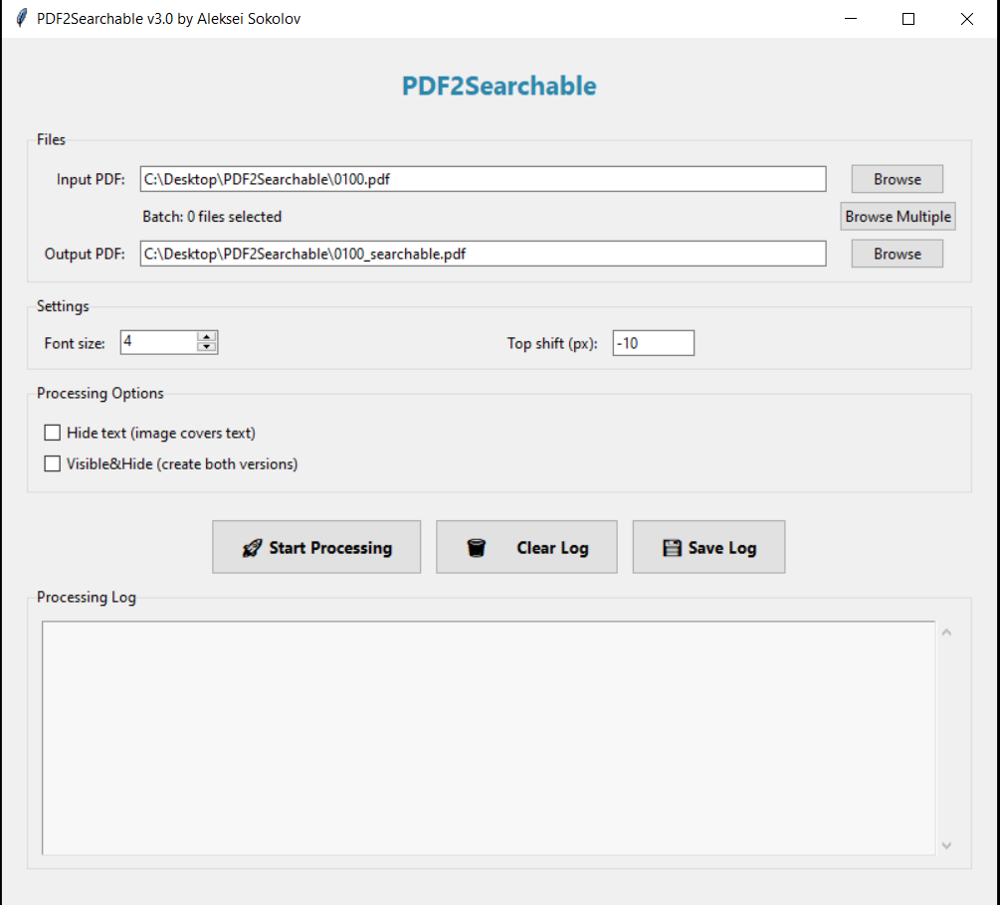
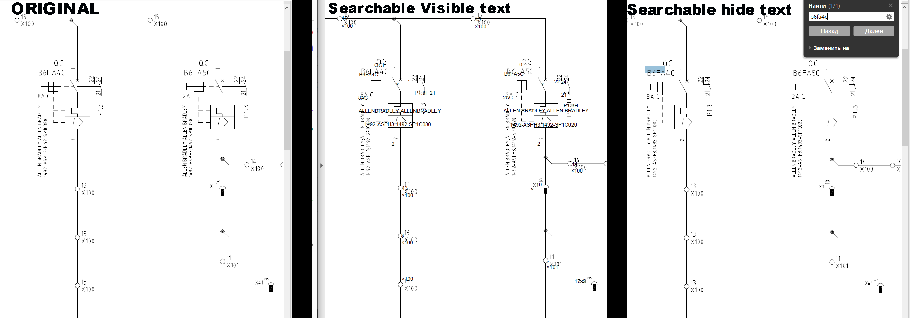

# PDF2Searchable


[English](#english) | [Русский](#русский)

---

<a name="english"></a>
# PDF2Searchable (English)

Application for text recognition on technical drawings and creating searchable PDF files.

## Description

PDF2Searchable uses OCR (Optical Character Recognition) technology based on PaddleOCR to recognize text on technical drawings and documents. The program creates a new version of the PDF file with recognized text that can be searched, copied, and highlighted.

## Key Features

- Text recognition on drawings and technical documents
- Creating searchable PDFs while preserving original formatting
- Graphical user interface for easy operation
- Batch processing of multiple files
- Configurable recognition parameters (font size, text offset)
- Support for various page orientations



## Requirements

- Python 3.13.5+ or higher
- Windows (tested on Windows 10/11)
- Minimum 4 GB RAM
- AMD processor (runs very slowly on Intel processors)
- GPU not utilized

## Installation

### Automatic Installation

Install python (exist in Install folder)
1. Run `Start.bat` - the program will automatically check and install required dependencies
(you can choose (1) local installation from install\LocalPackages)
2. On first launch, all required packages will be installed

### Manual Installation

1. Install Python 3.13.5+ from [python.org](https://www.python.org/)
2. Install dependencies:
   ```bash
   pip install -r requirements.txt
   ```
3. Ensure PaddleOCR models are in the `models/` folder

## Usage

### Launching the Program

1. Run `Start.bat` or execute:
   or
2. `python gui_windowsv2.py`
   or
3. `StartHidden.vbs` (shows only the GUI window and hides the terminal window)

### Processing a File

1. Select an input PDF file via the "Select File" button
2. Specify the output path (or leave automatic)
3. Configure parameters if needed:
   - Recognized text font size
   - Vertical text offset (this parameter only shifts text blocks located above the middle of the page)
   
4. Click "Process" to start recognition

### Batch Processing

The program supports processing multiple files simultaneously. Select multiple files through the interface for batch processing.

5. For PDF file preparation, use two utilities:
   - **PDF_Splitter**: (split/merge large PDF files)
   - **PDF Compressor**: (Compress ready searchable PDFs)

## Project Structure

```
PDF2Searchable/
├── gui_windowsv2.py          # Graphical interface
├── run_process_0100.py        # Main PDF processing module
├── ocr_utils_fixed.py         # OCR processing utilities
├── models/                    # Local PaddleOCR models
│   ├── det/                   # Text detection models
│   ├── rec/                   # Text recognition models
│   ├── doc_orient/            # Orientation detection models
│   └── ...
├── Install/                   # Installation files
├── requirements.txt           # Python dependencies
├── Start.bat                  # Launch script
└── README.md                  # Documentation
```

## Processing Parameters

The program uses the following default settings:

- **OCR Engine**: PaddleOCR v3.2
- **Language**: English
- **Image Preprocessing**: Automatic optimization for technical drawings

## Troubleshooting

### Program Won't Start

1. Ensure Python 3.8+ is installed and added to PATH
2. Check installation of all dependencies: `pip install -r requirements.txt`
3. Run `Install/install_deps.py` for automatic installation

### Processing Errors

1. Check that models are present in the `models/` folder
2. Ensure sufficient free disk space

### Slow Processing

1. Intel processors run very slowly with PaddleOCR.

## Licensing

### Project License

This project is distributed under the MIT License. See [LICENSE](LICENSE) for details.

### Dependency Licenses

The project uses the following third-party libraries:

- **PaddleOCR** (Apache 2.0)
- **PyMuPDF** (AGPL-3.0) - ⚠️ Please note AGPL-3.0 requirements
- **OpenCV-Python** (Apache 2.0)
- **NumPy** (BSD 3-Clause)
- **pikepdf** (MPL-2.0)
- **PaddlePaddle** (Apache 2.0)

For a complete list of dependencies and their licenses, see [THIRD_PARTY_LICENSES.md](THIRD_PARTY_LICENSES.md).

**Important**: PyMuPDF uses the AGPL-3.0 license, which is a copyleft license. When using, modifying, or distributing this project, ensure you comply with AGPL-3.0 requirements.

## Author

Aleksei Sokolov
wisesokol@icloud.com
## Version

v3.0

---

<a name="русский"></a>
# PDF2Searchable (Русский)

Программа для распознавания текста на чертежах и создания searchable (поисковых) версий PDF файлов.

## Описание

PDF2Searchable использует технологию OCR (Optical Character Recognition) на базе PaddleOCR для распознавания текста на технических чертежах и документах. Программа создает новую версию PDF файла с распознанным текстом, который можно искать, копировать и выделять.

## Основные возможности

- Распознавание текста на чертежах и технических документах
- Создание searchable PDF с сохранением оригинального форматирования
- Графический интерфейс для удобной работы
- Пакетная обработка нескольких файлов
- Настройка параметров распознавания (размер шрифта, смещение текста)
- Поддержка различных ориентаций страниц

## Требования

- Python 3.13.5 или выше
- Windows (тестировалось на Windows 10/11)
- Минимум 4 ГБ оперативной памяти
- Процессор AMD (на процессорах Intel работает очень медленно)
- GPU не задействован

## Установка

### Автоматическая установка
Установите Python (Доступен в папке Install)
1. Запустите `Start.bat` - программа автоматически проверит и установит необходимые зависимости
(Вы можете выбрать опцию 1, она установит уже скачанные пакеты из папки Install\LocalPackages)
2. При первом запуске будут установлены все требуемые пакеты

### Ручная установка

1. Установите Python 3.13.5+ с официального сайта [python.org](https://www.python.org/)
2. Установите зависимости:
   ```bash
   pip install -r requirements.txt
   ```
3. Убедитесь, что модели PaddleOCR находятся в папке `models/`

## Использование

### Запуск программы

1. Запустите `Start.bat` или выполните:
или
2. `python gui_windowsv2.py`
или
3. `StartHidden.vbs` (показывает только окно GUI и скрывает окно терминала)

### Обработка файла

1. Выберите входной PDF файл через кнопку "Выбрать файл"
2. Укажите путь для сохранения результата (или оставьте автоматический)
3. Настройте параметры при необходимости:
   - Размер шрифта распознанного текста
   - Смещение текста по вертикали (данный параметр смещает только тексттовые блоки, находящиеся выше середины листа)
   
4. Нажмите "Обработать" для начала распознавания

### Пакетная обработка

Программа поддерживает обработку нескольких файлов одновременно. Выберите несколько файлов через интерфейс для пакетной обработки.

5. Для подготовки файлов PDF используйте две утилиты:
    - **PDF_Splitter**: (разбивка/слияние больших файлов PDF)
    - **PDF Compressor**: (Сжатие готовых serachable PDF)

## Структура проекта

```
PDF2Searchable/
├── gui_windowsv2.py          # Графический интерфейс
├── run_process_0100.py        # Основной модуль обработки PDF
├── ocr_utils_fixed.py         # Утилиты OCR обработки
├── models/                    # Локальные модели PaddleOCR
│   ├── det/                   # Модели детекции текста
│   ├── rec/                   # Модели распознавания текста
│   ├── doc_orient/            # Модели определения ориентации
│   └── ...
├── Install/                   # Файлы установки
├── requirements.txt           # Зависимости Python
├── Start.bat                  # Скрипт запуска
└── README.md                  # Документация
```

## Параметры обработки

Программа использует следующие настройки по умолчанию:

- **OCR движок**: PaddleOCR v3.2
- **Язык**: Английский 
- **Предобработка изображений**: Автоматическая оптимизация для технических чертежей

## Устранение неполадок

### Программа не запускается

1. Убедитесь, что Python 3.8+ установлен и добавлен в PATH
2. Проверьте установку всех зависимостей: `pip install -r requirements.txt`
3. Запустите `Install/install_deps.py` для автоматической установки

### Ошибки при обработке

1. Проверьте наличие моделей в папке `models/`
2. Убедитесь, что достаточно свободного места на диске

### Медленная обработка

1. Процессоры Intel работают очень медленно с PaddleOCR.

## Лицензирование

### Лицензия проекта

Этот проект распространяется под лицензией MIT. Подробности см. в файле [LICENSE](LICENSE).

### Лицензии зависимостей

Проект использует следующие сторонние библиотеки:

- **PaddleOCR** (Apache 2.0)
- **PyMuPDF** (AGPL-3.0) - ⚠️ Обратите внимание на требования AGPL-3.0
- **OpenCV-Python** (Apache 2.0)
- **NumPy** (BSD 3-Clause)
- **pikepdf** (MPL-2.0)
- **PaddlePaddle** (Apache 2.0)

Полный список зависимостей и их лицензий см. в файле [THIRD_PARTY_LICENSES.md](THIRD_PARTY_LICENSES.md).

**Важно**: PyMuPDF использует лицензию AGPL-3.0, которая является копилефт-лицензией. При использовании, модификации или распространении этого проекта убедитесь, что вы соблюдаете требования AGPL-3.0.

## Автор

Aleksei Sokolov
wisesokol@icloud.com

## Версия

v3.0


